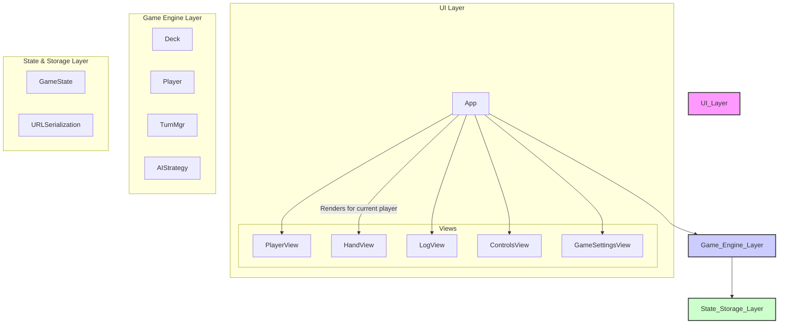

# System Patterns

The application is structured into three distinct layers, promoting a clear separation of concerns. The UI layer is orchestrated by a central `App` component.



## 1. UI Layer

*   **Responsibilities**: Renders the game state and captures user input.
*   **Pattern**: The UI is managed by a central `App` component (`app.ts`) which holds the application state and orchestrates the main **game loop**. It renders a set of stateless view components and handles user input events. This creates a unidirectional data flow.
    *   `App`: The orchestrator. Manages state and the main `gameLoop`.
    *   `PlayerView`: Shows a single player's progress, status, and in-play cards.
    *   `HandView`: Displays the current player's cards. It is now rendered directly below the current player's `PlayerView`.
    *   `LogView`: A running log of game events.
    *   `ControlsView`: UI buttons for game actions.
    *   `GameSettingsView`: Allows the user to configure the number of players and their type (Human or AI) before starting a new game.

## 2. Game Engine Layer

*   **Responsibilities**: Contains the core game logic and rules.
    *   `Deck`: Manages the card deck (shuffling, drawing, discarding).
    *   `Player`: Represents a player's state (hand, cards in play, AI status).
    *   `AIStrategy`: Provides different AI strategy objects. This is where the logic for different AI personalities resides (e.g. `HeuristicStrategy`, `AggressorStrategy`). The strategies are located in `src/engine/strategies`.
*   **Pattern**: This layer is stateless in the sense that it operates on the game state provided to it. It exposes pure functions that take the current state and a user action, and return a new, updated state. The `App` component's `gameLoop` calls these functions to advance the game.

## 3. Pure Function State Management

A core principle of the game engine is its use of pure functions for all state transitions. This pattern was adopted to decouple the game's core logic from the UI layer (`App.ts`), which was making testing difficult and the architecture brittle.

*   **Initial Problem**: Critical game logic, such as `playCard`, was implemented as private methods within the `App` class. Because the `App` class is tightly coupled to the DOM (via `lit-html` and `window`/`document` access), it was impossible to unit test this logic in a standard Node.js test environment. Attempts to mock the DOM and its dependencies proved to be complex and unreliable.

*   **Solution: Logic Extraction**:
    *   The `playCard` logic was extracted from the `App` class and moved into `src/engine/game.ts`.
    *   It was implemented as a pure function: `export function playCard(gameState: GameState, ...): GameState`.
    *   This function now takes the complete `GameState` as an argument and returns a *new*, updated `GameState` object, without mutating the original.
    *   The `App` class's `playCard` method was refactored into a thin wrapper that simply calls this new pure function and replaces its internal state with the returned new state: `this.state = playCard(this.state, ...);`.

*   **Benefits**:
    *   **Testability**: The core game logic is now trivial to unit test. We can call the pure function with a crafted `GameState` and assert that the returned state is correct, with no need for DOM simulation.
    *   **Decoupling**: The `engine` is now a standalone module that is not aware of the `ui` layer. This makes the codebase cleaner and easier to reason about.
    *   **Predictability**: Since all state changes are handled by pure functions, the behavior of the game is highly predictable and free of side effects.

## 4. Asynchronous Turn Management

A critical architectural pattern is the central, asynchronous `gameLoop` within the `App` component. This loop is the heart of the game's turn-based flow and was implemented to solve a significant race condition bug related to concurrent AI turns.

*   **Initial Problem**: The previous event-based system used a simple boolean flag (`isAITurnInProgress`) to prevent AI turns from overlapping. This approach was fragile and failed when multiple AI players took turns in succession, as the flag was not reset before the next turn was checked, causing the game to stall.

*   **Solution: The Game Loop**:
    ```mermaid
    flowchart TD
        Start[Start Game] --> GameLoop{gameLoop};
        GameLoop -- Is Current Player AI? --> |Yes| AITurn[await handleAITurn()];
        GameLoop -- Is Current Player AI? --> |No| HumanTurn[await waitForHumanAction()];
        AITurn --> CheckWin{Winner?};
        HumanTurn --> CheckWin;
        CheckWin --> |No| Advance[Advance Turn & Draw Card];
        Advance --> GameLoop;
        CheckWin --> |Yes| End[End Game];
    end
    ```

*   **How it Works**:
    *   The `gameLoop` method is an `async` function that runs continuously until a winner is found.
    *   **For AI turns**, it `await`s the `handleAITurn` method. This method contains all the logic for an AI's move, including UI delays. The loop naturally pauses until the AI's turn is fully complete.
    *   **For human turns**, it `await`s a `waitForHumanAction` method. This method returns a promise that only resolves when the human player clicks a valid action button. The UI event handlers for playing or discarding cards are responsible for resolving this promise.
    *   This design elegantly handles both synchronous (human) and asynchronous (AI) actions without complex state flags, eliminating the race condition and making the game's control flow robust and predictable.

## 5. State & Storage Layer

*   **Responsibilities**: Manages the application's single source of truth and handles persistence.
*   **Pattern**:
    *   **Single State Object**: The entire game state is held in a single JavaScript object (`GameState`).
    *   **State Serialization**: On every state change, the `GameState` object is serialized to a Base64-encoded JSON string.
    *   **URL Persistence**: This string is stored in the browser's URL hash (`window.location.hash`). This makes the game state bookmarkable and shareable. On page load, the application checks for a hash and, if present, decodes it to restore the game.

## 6. Core Engine Patterns

*   **Pure Functions for State Transitions**: As described above, all major game actions (`playCard`, `advanceTurn`, `applyCardToPlayer`) are implemented as pure functions in `src/engine/game.ts`. They take a state object and return a new state object, ensuring an immutable and predictable data flow.
*   **Type-Safe Constants**: All magic strings (card names, types, etc.) are defined as exported constants in `src/types.ts`. This ensures consistency and allows for static type checking, preventing typos and runtime errors.
*   **Centralized Rule Enforcement**: A single, pure function, `isCardPlayable(card, gameState)`, serves as the definitive source of truth for all card playability rules. It resides in `src/types.ts` and is used by both the UI layer (to enable/disable buttons) and the AI strategies (to make legal moves). This ensures that rules are consistent across the entire application and easy to test.
*   **AI Strategy Pattern**: The AI is implemented using a Strategy design pattern. An `AIStrategy` interface defines a contract for how an AI should make a move (`decideMove`). Concrete implementations, like `HeuristicStrategy` and `AggressorStrategy`, provide different "personalities" by implementing this interface. This pattern makes it easy to add new AI behaviors without changing the core game logic. The strategies are stateless and receive the full `GameState` for decision-making, ensuring their actions are predictable and testable. The strategies are located in `src/engine/strategies`. The strategies now use the centralized `isCardPlayable` function to ensure they only attempt valid moves.
*   **Helper Functions**: Common logic, such as checking for immunity (`isImmuneTo`), green lights (`hasGreenLight`), or finding a player's opponents (`getPlayersOpponents`), is extracted into pure, reusable helper functions within `src/types.ts` and `src/engine/game.ts`. This promotes code reuse and simplifies component logic (like AI Strategies).
*   **Centralized Card Definitions**: The master list of all game cards is defined in `src/engine/cards.ts`, using the aforementioned type-safe constants. This serves as the single source of truth for all card data. 