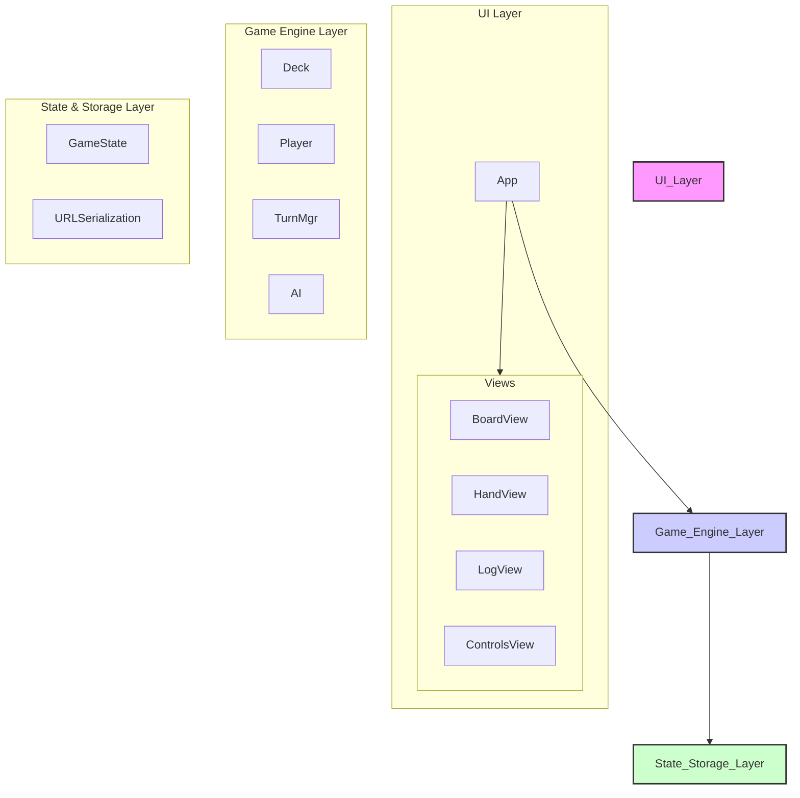

# System Patterns

The application is structured into three distinct layers, promoting a clear separation of concerns. The UI layer is orchestrated by a central `App` component.

## 1. UI Layer

*   **Responsibilities**: Renders the game state and captures user input.
*   **Pattern**: The UI is managed by a central `App` component (`app.ts`) which holds the application state. It renders a set of stateless view components and handles events from them. When the state changes, the `App` re-renders the necessary parts of the UI. This creates a unidirectional data flow.
    *   `App`: The orchestrator. Manages state and the render loop.
    *   `BoardView`: Shows each player's progress and status.
    *   `HandView`: Displays the current player's cards.
    *   `LogView`: A running log of game events.
    *   `ControlsView`: UI buttons for game actions.

## 2. Game Engine Layer

*   **Responsibilities**: Contains the core game logic and rules.
    *   `Deck`: Manages the card deck (shuffling, drawing, discarding).
    *   `Player`: Represents a player's state (hand, cards in play).
    *   `TurnMgr`: Manages turn order and win conditions.
    *   `AI`: Provides a simple opponent strategy.
*   **Pattern**: This layer is stateless in the sense that it operates on the game state provided to it. It exposes functions that take the current state and a user action, and return a new, updated state.

## 3. State & Storage Layer

*   **Responsibilities**: Manages the application's single source of truth and handles persistence.
*   **Pattern**:
    *   **Single State Object**: The entire game state is held in a single JavaScript object (`GameState`).
    *   **State Serialization**: On every state change, the `GameState` object is serialized to a Base64-encoded JSON string.
    *   **URL Persistence**: This string is stored in the browser's URL hash (`window.location.hash`). This makes the game state bookmarkable and shareable. On page load, the application checks for a hash and, if present, decodes it to restore the game.

## 4. Core Engine Patterns

*   **Type-Safe Constants**: All magic strings (card names, types, etc.) are defined as exported constants in `src/types.ts`. This ensures consistency and allows for static type checking, preventing typos and runtime errors.
*   **Helper Functions**: Common logic, such as checking for immunity (`isImmuneTo`) or finding a player's opponents (`getPlayersOpponents`), is extracted into pure, reusable helper functions within `src/types.ts` and `src/engine/game.ts`. This promotes code reuse and simplifies component logic (like AI Strategies).
*   **Centralized Card Definitions**: The master list of all game cards is defined in `src/engine/cards.ts`, using the aforementioned type-safe constants. This serves as the single source of truth for all card data. 